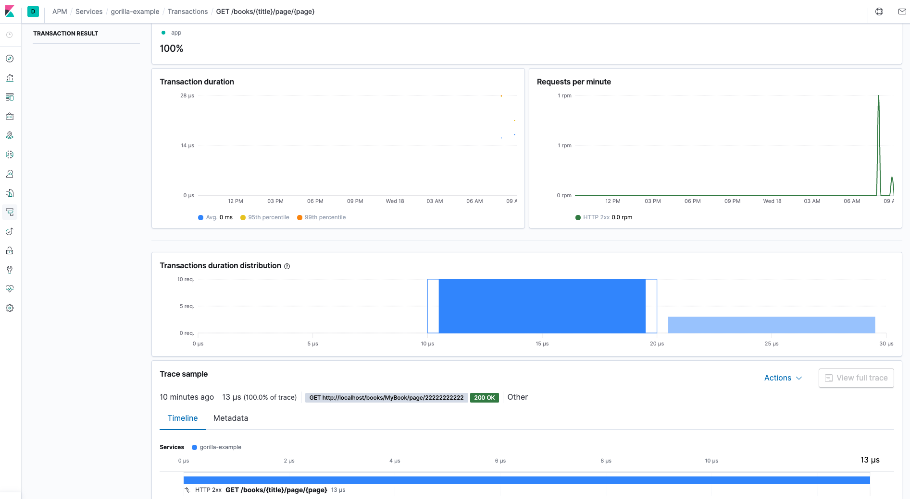

# Gorilla example

Example on how to instrument a web service based on the [_Gorilla_](https://www.gorillatoolkit.org/) web toolkit using the [_Elastic APM Go agent_](https://github.com/elastic/apm-agent-go).

Please refer to the main [setup instructions](/README.md) before running the example.

## Run the example 

* `./gorilla-example` to run a simple service based on the _Gorilla_ web toolkit.
* Try calling the service few times. For instance: Using _curl_ `curl -X GET -I "http://localhost/books/MyBook/page/132"`
* Browse to your _Kibana_ application in `http://localhost:5601/app/apm#/services/gorilla-example/`

Then you should see something like the screenshots below.

